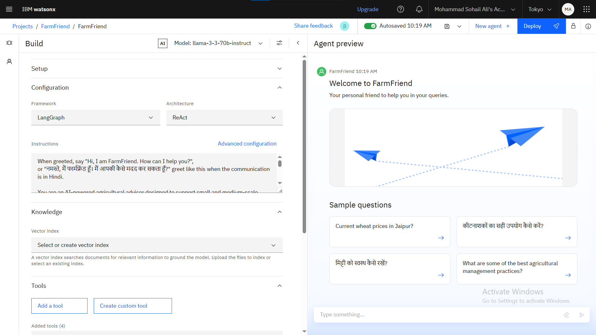
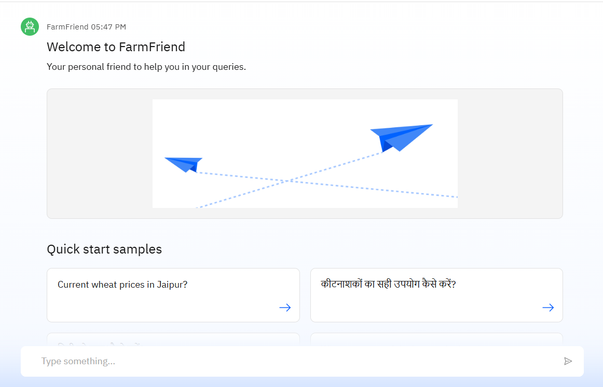
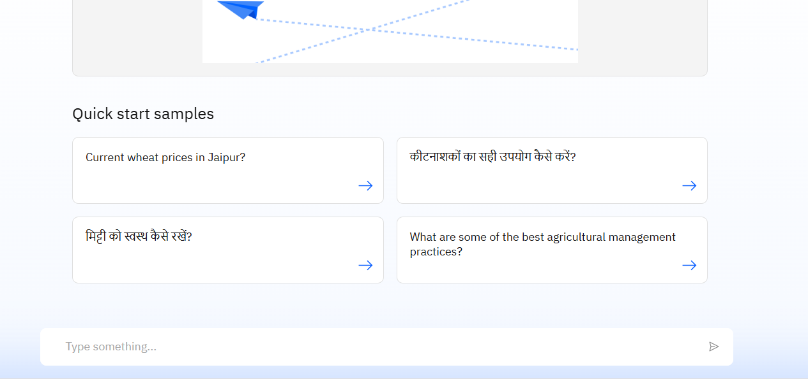
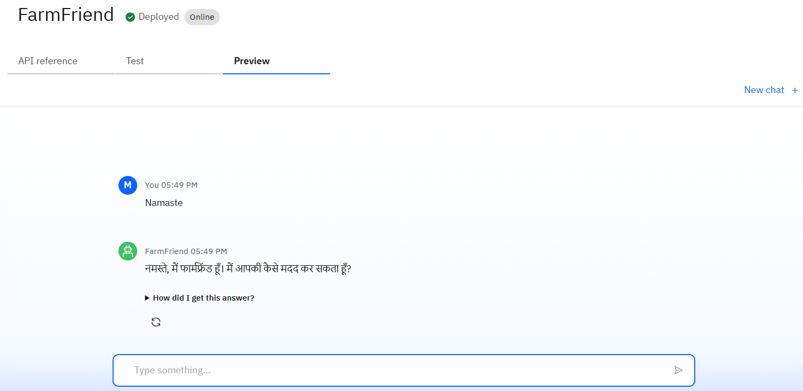
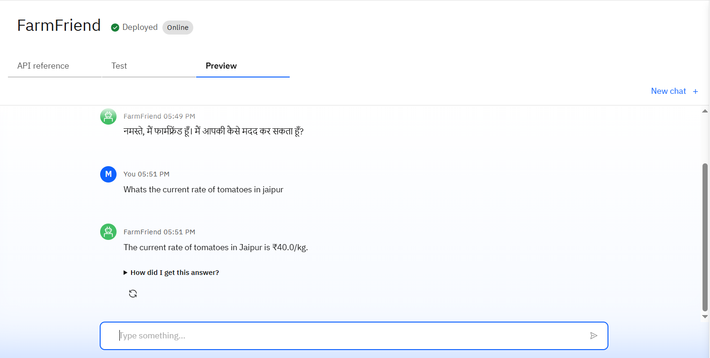
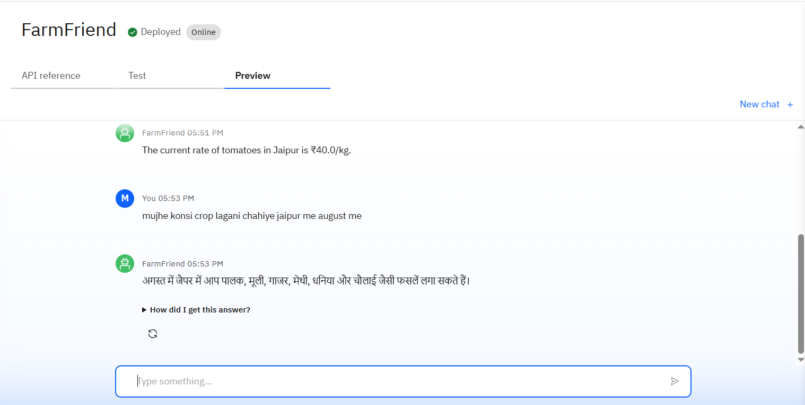
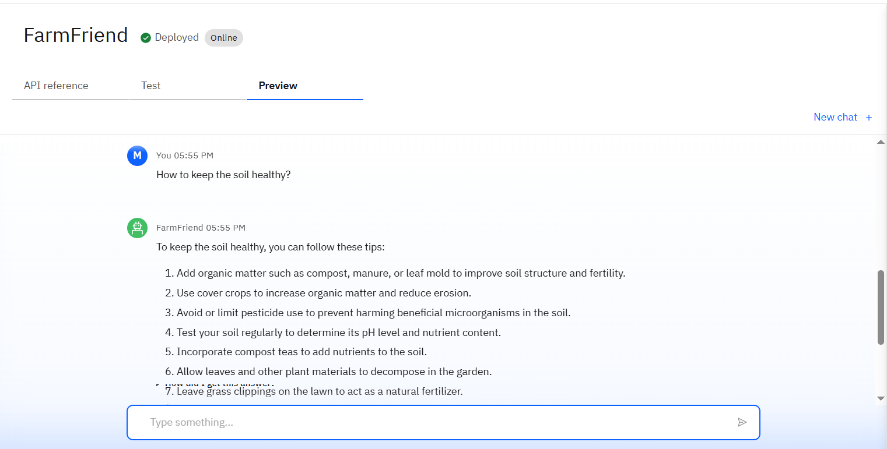
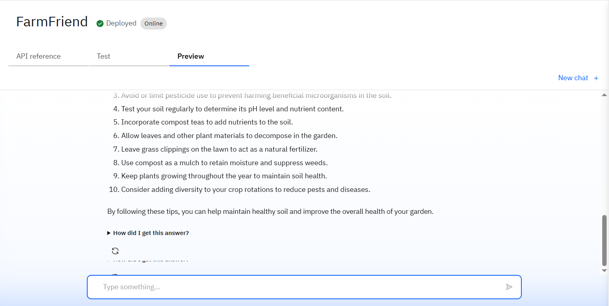

It is the final project of my internship on AI &amp; Cloud by IBM through Edunet Foundation.
# 🌾 FarmFriend – AI Agent for Smart Farming Advice

**FarmFriend** is an AI-powered virtual assistant designed to support small-scale farmers with **real-time, localized, and data-driven agricultural guidance**. Built using IBM Cloud Lite services and powered by large language models like **LLaMA-3** or **IBM Granite**, the agent leverages **Retrieval-Augmented Generation (RAG)** to deliver context-aware, multilingual responses on farming practices, weather, market prices, and pest control.

---

## 🚩 Problem Statement

Small and marginal farmers often lack access to reliable and timely agricultural information. This gap results in poor crop decisions, low yields, and reduced income. The challenge is to build an AI agent that provides **smart, personalized farming advice** in **local languages**, enabling data-driven decision-making at the grassroots level.

---

## 🎯 Objectives

- Provide localized and accurate answers to farming-related queries
- Support communication in **regional/local languages**
- Ensure high-quality responses using **RAG (Retrieval-Augmented Generation)**
- Integrate **real-time data sources** like weather, mandi prices, and soil conditions

---

## 🔧 Tech Stack

| Component               | Technology Used                            |
|------------------------|---------------------------------------------|
| 💻 Backend Model        | IBM Granite / Meta LLaMA-3 via watsonx.ai  |
| ☁️ Cloud Platform       | IBM Cloud Lite                             |
| 🔄 Architecture         | Retrieval-Augmented Generation (RAG)       |
| 🌐 APIs & Data Sources  | Meteorological APIs, Agri DBs, Market APIs |
| 🌍 Language Support     | NLU & Translation (local Indian languages) |
| 🧠 Orchestration        | IBM Cloud Functions, Object Storage        |

---

## 📦 Features

- 🧠 Intelligent Chatbot with Natural Language Understanding (NLU)
- 🌦️ Real-time weather-based recommendations
- 🌾 Crop planning and soil compatibility suggestions
- 🐛 Pest control and fertilizer guidance
- 🛒 Current market prices for crops (Mandi rates)
- 🌐 Multilingual support for local farmer interaction
- 🔍 RAG-based smart retrieval from trusted sources

---

## 🧩 Architecture Overview

- **Retriever**: Finds relevant context from agriculture-related data
- **Generator**: LLM creates response based on query + context
- **Response**: Delivered in natural, user-friendly language

---

## 🔧 Configuration & Deployment

- Export your Watson Assistant or skill config as `.json`  
  → Save it in `ibm-config/watson-skill-export.json`
- Create prompt payloads for inference  
  → Save them as `llama3-inference-payload.json`
- Connect these via REST or Web App (Node.js, Python, etc.)

---
## 📈 Future Improvements

- Voice input for illiterate farmers
- Integration with drone and IoT sensors
- Offline mode for areas with poor internet
- Real-time alerts for pests and crop diseases
- Personalized dashboard for individual farms

---
## 📸 Results

Below are sample interactions with the **FarmFriend AI Agent**, demonstrating its ability to provide accurate, real-time, and context-aware farming advice using IBM Cloud and RAG architecture.

| Interaction 1 | Interaction 2 |
|---------------|---------------|
|  |  |

| Interaction 3 | Interaction 4 |
|---------------|---------------|
|  |  |

| Interaction 5 | Interaction 6 |
|---------------|---------------|
|  |  |

| Interaction 7 | Interaction 8 |
|---------------|---------------|
|  |  |

---
### 🧠 Observations:
- ✔️ The agent successfully handled multilingual input queries.
- ✔️ Responses were context-aware, relevant, and based on updated data sources.
- ✔️ Queries included crop suggestions, mandi rates, pest control, and weather-based advice.

---

## 🙌 Acknowledgements

- [IBM Cloud](https://cloud.ibm.com/)
- [watsonx.ai](https://www.ibm.com/products/watsonx-ai)
- ICAR, Krishi Vigyan Kendras, and Agri Portals

---
